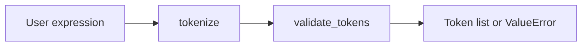

# LAB Project: Arithmetic Parser

Python lab work focused on tokenizing and validating arithmetic expressions. Includes milestone scripts and a Colab notebook.

## What it does

`ArithmeticParser` compiles a regex, splits an expression into tokens (numbers, operators, parentheses), validates each token, and reports errors when something illegal shows up.

## Architecture



## Files

| File | Role |
|------|------|
| `milestone-1.py` | Early parser milestone |
| `milestone2and3.py` | Later milestones |
| `Welcome_To_Colab.ipynb` | Notebook walkthrough |

## Try it

```bash
python3 milestone-1.py
# or
python3 milestone2and3.py
```

Enter expressions like `12 + (3 * 4)` and inspect the token stream.

## Learning goals

- Regex-based lexing in Python
- Defensive validation with clear errors
- Incremental milestones toward a fuller expression pipeline
